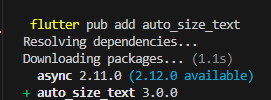
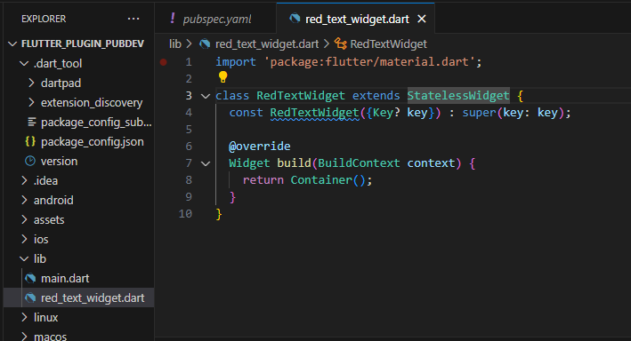
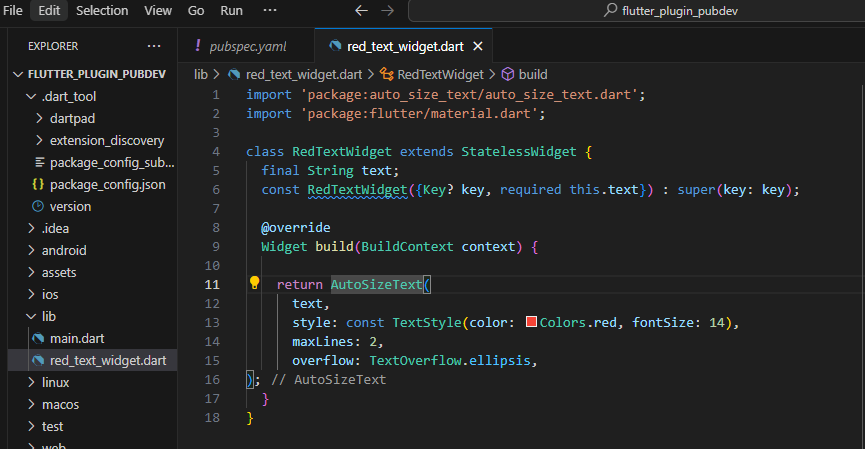
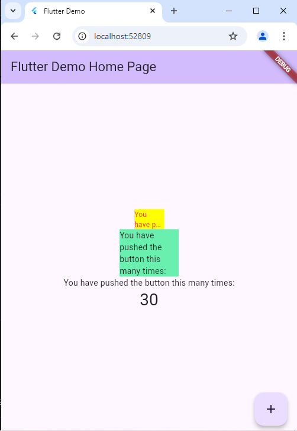

 # Praktikum Menerapkan Plugin di Project Flutter

 Langkah 1: Buat Project Baru

 Langkah 2: Menambahkan Plugin

 

 Langkah 3: Buat file red_text_widget.dart

 

 Langkah 4: Tambah Widget AutoSizeText

 

 Langkah 5: Buat Variabel text dan parameter di constructor

 

 Langkah 6: Tambahkan widget di main.dar

 
 
 Run aplikasi tersebut dengan tekan F5, maka hasilnya akan seperti berikut.

 

 1. Selesaikan Praktikum tersebut, lalu dokumentasikan dan push ke repository Anda berupa screenshot hasil pekerjaan beserta penjelasannya di file README.md!

Jawab:done

2. Jelaskan maksud dari langkah 2 pada praktikum tersebut!

Jawab:
Kode flutter pub add auto_size_text digunakan untuk menambahkan package auto_size_text ke dalam proyek Flutter. Package ini berguna untuk membuat widget teks yang secara otomatis menyesuaikan ukuran font agar sesuai dengan batas area yang tersedia, sehingga teks tidak terpotong atau melampaui batas widget.

3. Jelaskan maksud dari langkah 5 pada praktikum tersebut!

Jawab:

Kode di atas adalah konstruktor dari sebuah widget Flutter bernama RedTextWidget, yang digunakan untuk membuat widget dengan teks yang harus diterima sebagai parameter.Singkatnya, ini adalah konstruktor untuk widget yang menerima teks sebagai input, dengan parameter text wajib diisi dan memungkinkan widget menjadi konstan.

4. Pada langkah 6 terdapat dua widget yang ditambahkan, jelaskan fungsi dan perbedaannya!

Jawab:
1. Container Pertama

Fungsi:

- Membuat sebuah Container dengan warna latar belakang kuning (yellowAccent).

- Memiliki lebar sebesar 50 piksel.
- Di dalamnya terdapat sebuah RedTextWidget yang menampilkan teks 'You have pushed the button this many times:'.

2. Container Kedua

Fungsi:

- Membuat sebuah Container dengan warna latar belakang hijau (greenAccent).
- Memiliki lebar sebesar 100 piksel.
- Di dalamnya terdapat widget Text yang menampilkan teks 'You have pushed the button this many times:' dengan gaya teks standar (tanpa modifikasi khusus).

Perbedaan Utama:

Widget yang digunakan:

- Container pertama menggunakan RedTextWidget, yang merupakan widget kustom. Meskipun tidak ditampilkan di sini, widget ini bisa memiliki gaya atau perilaku khusus (misalnya, teks berwarna merah).
- Container kedua menggunakan widget Text bawaan Flutter, yang hanya menampilkan teks biasa tanpa modifikasi tambahan.

4. Jelaskan maksud dari tiap parameter yang ada di dalam plugin auto_size_text berdasarkan tautan pada dokumentasi ini !

Jawab:

- AutoSizeText: Usage

AutoSizeText digunakan untuk membuat teks yang secara otomatis menyesuaikan ukuran font agar sesuai dengan batas ruang yang tersedia. Ini berguna untuk mencegah teks terpotong atau melebihi batas dari widgetnya.

- maxLines

Parameter ini menentukan jumlah maksimal baris teks yang bisa ditampilkan. Jika teks lebih panjang dari jumlah baris yang diizinkan, ukuran teks akan diperkecil hingga sesuai.

- minFontSize & maxFontSize

- minFontSize: 

Ukuran minimal font yang diizinkan saat teks berusaha menyesuaikan ukuran dengan ruang yang tersedia.

- maxFontSize: 

Ukuran maksimal font yang diizinkan. Jika ukuran teks melebihi batas ini, tidak akan diperbesar lagi.
group

- AutoSizeTextGroup
 memungkinkan beberapa widget AutoSizeText untuk berbagi ukuran font yang sama. Ini berguna ketika Anda ingin beberapa teks pada layar memiliki ukuran font yang konsisten.

- stepGranularity

Menentukan langkah perubahan ukuran teks saat teks menyesuaikan ukurannya. Nilai default adalah 1 (artinya ukuran font akan berubah per 1 unit).

- presetFontSizes

Jika Anda ingin teks memilih dari serangkaian ukuran font yang telah ditentukan, Anda bisa menggunakan presetFontSizes. Ini memberikan kontrol yang lebih besar dalam menentukan ukuran font yang digunakan.

- overflowReplacement

Jika teks tidak dapat menyesuaikan dengan ukuran yang tersedia, Anda bisa memberikan alternatif tampilan dengan overflowReplacement. Ini biasanya digunakan untuk menggantikan teks yang terlalu panjang.

- Rich Text

AutoSizeText mendukung penggunaan RichText, sehingga Anda bisa menampilkan teks dengan gaya dan format yang kompleks (misalnya dengan teks yang berbeda warna, ukuran, atau tebal dalam satu tampilan).

- Parameters

- AutoSizeText 

menerima parameter yang mirip dengan widget Text, seperti:

style: Mengatur gaya teks (warna, ketebalan, jenis huruf).
textAlign: Menentukan perataan teks (kiri, tengah, kanan).
softWrap: Menentukan apakah teks harus membungkus otomatis.
Performance
AutoSizeText memerlukan sedikit waktu lebih lama dibandingkan Text karena kalkulasi ukuran font yang dinamis. Namun, ini hanya terjadi saat pertama kali render, sehingga dampaknya minimal.

- Troubleshooting Missing bounds

Jika widget tidak memiliki batas ukuran yang jelas, AutoSizeText tidak bisa bekerja dengan baik. Pastikan widget dibungkus dalam container atau memiliki batas yang tegas seperti dalam SizedBox atau Expanded.

- MinFontSize too large

Jika minFontSize terlalu besar, teks mungkin tidak akan muat dalam ruang yang tersedia, sehingga perlu disesuaikan agar lebih kecil dari ruang yang disediakan.

5. Kumpulkan laporan praktikum Anda berupa link repository GitHub kepada dosen!

Jawab:done